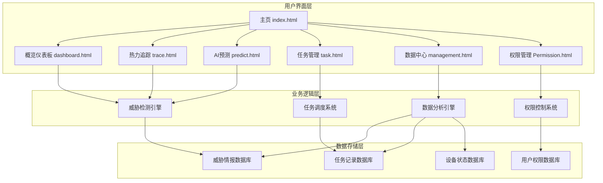
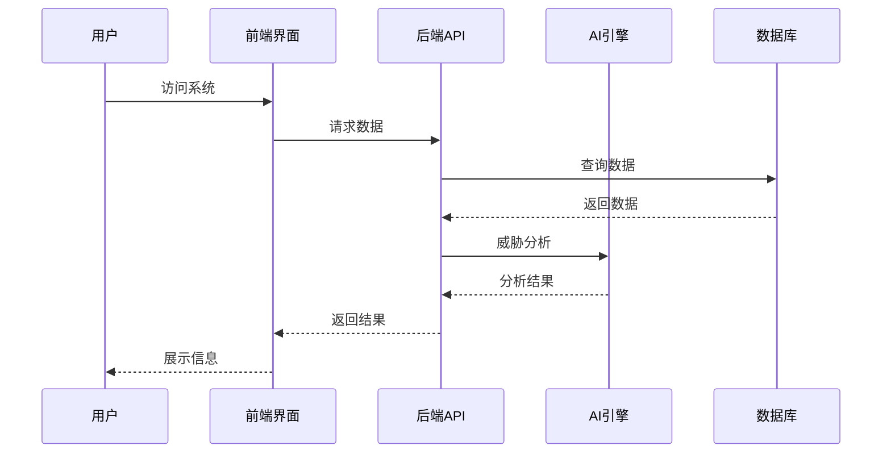

# 慧音执守-物联网语音安全领航者

> 基于AI深度学习的智能语音安全防护平台


## 🛡️ 系统概述

慧音卫士是一款专业的语音安全监控与防护平台，采用先进的人工智能技术，实时检测和防护各类语音安全威胁。系统集成了威胁监控、智能分析、任务管理、数据可视化等核心功能，为用户提供全方位的语音通信安全保障。

### 核心价值
- 🔍 **实时监控**：24/7不间断监控，毫秒级威胁响应
- 🧠 **AI智能**：基于深度学习，检测准确率达97.3%
- 📊 **数据可视化**：直观的热力图和统计图表展示
- ⚡ **快速响应**：自动化任务分配和处理流程
- 🔐 **安全可靠**：多层权限控制，确保数据安全

## 📋 功能模块

### 1. 概览仪表板 (Dashboard)
**文件**: `dashboard.html`

- **实时统计展示**
  - 今日检测事件：247起
  - 在线监控设备：1,847台
  - 高风险区域：12个
  - 任务完成率：89.3%

- **数据可视化**
  - 任务完成率趋势图
  - 威胁类型分布饼图
  - 区域任务分布地图
  - 设备状态监控图表

- **实时告警信息**
  - 高危、中危、低危告警分级显示
  - 一键处理功能
  - 告警详情查看

### 2. 热力追踪 (Trace)
**文件**: `trace.html`

- **地理热力图**
  - 实时攻击密度展示
  - 热力模式/标点模式切换
  - 区域风险等级标识

- **威胁分布分析**
  - 按地理位置统计威胁事件
  - 攻击类型地域分布
  - 时间轴威胁演进

- **交互功能**
  - 地图缩放和拖拽
  - 区域点击详情查看
  - 实时数据更新

### 3. AI感知与预测 (Predict)
**文件**: `predict.html`

- **智能威胁检测**
  - 探针攻击识别
  - 语音劫持检测
  - 数据窃取监控

- **预测分析**
  - 基于机器学习的威胁预测
  - 风险评估算法
  - 趋势分析报告

- **AI模型管理**
  - 模型训练状态监控
  - 算法准确率统计
  - 模型版本管理

### 4. 任务管理 (Task)
**文件**: `task.html`

- **任务中心**
  - 任务列表管理
  - 任务状态跟踪
  - 批量操作功能

- **任务分配**
  - 智能任务分配
  - 人员工作负载监控
  - 任务优先级管理

- **统计分析**
  - 任务完成统计
  - 人员效率排名
  - 任务类型分布

### 5. 数据中心 (Management)
**文件**: `management.html`

- **数据统计**
  - 攻击事件统计
  - 设备状态监控
  - 处理效率分析

- **报表生成**
  - 自定义报表
  - 数据导出功能
  - 定时报告推送

- **数据筛选**
  - 多维度数据筛选
  - 时间范围选择
  - 关键词搜索

### 6. 权限管理 (Permission)
**文件**: `Permission.html`

- **用户管理**
  - 用户账户管理
  - 角色权限分配
  - 用户状态监控

- **权限控制**
  - 细粒度权限设置
  - 角色管理系统
  - 权限继承机制

- **安全审计**
  - 操作日志记录
  - 登录行为监控
  - 异常行为告警

## 🏗️ 技术架构

### 前端技术栈
```
├── HTML5 - 页面结构
├── CSS3 + Tailwind CSS - 样式框架
├── JavaScript (ES6+) - 交互逻辑
├── ECharts - 数据可视化
└── Remix Icon - 图标库
```

### 系统架构图


### 数据流架构


## 📊 系统特性

### 性能指标
| 指标 | 数值 | 说明 |
|------|------|------|
| 威胁检测准确率 | 97.3% | 基于深度学习算法 |
| 系统响应时间 | <100ms | 实时数据处理 |
| 并发用户数 | 1000+ | 支持大规模并发 |
| 数据处理能力 | 10万条/秒 | 高性能数据处理 |
| 系统可用性 | 99.9% | 7×24小时稳定运行 |

### 安全特性
- 🔐 **多层身份认证**：支持多种认证方式
- 🛡️ **数据加密传输**：全链路HTTPS加密
- 📝 **操作审计日志**：完整的操作记录
- ⚠️ **异常行为检测**：智能识别异常操作
- 🔒 **权限细粒度控制**：精确的权限管理

## 🚀 部署说明

### 环境要求
- **Web服务器**：Nginx 1.18+ 或 Apache 2.4+
- **浏览器支持**：Chrome 80+, Firefox 75+, Safari 13+
- **网络要求**：支持HTTPS协议
- **硬件要求**：2核CPU, 4GB内存, 100GB存储

### 快速部署
```bash
# 1. 克隆项目
git clone https://github.com/company/huiyin-guard.git

# 2. 进入项目目录
cd huiyin-guard

# 3. 配置Web服务器
cp nginx.conf /etc/nginx/sites-available/huiyin-guard
ln -s /etc/nginx/sites-available/huiyin-guard /etc/nginx/sites-enabled/

# 4. 启动服务
systemctl restart nginx
```

### 文件结构
```
huiyin-guard/
├── index.html              # 系统主页
├── dashboard.html           # 概览仪表板
├── trace.html              # 热力追踪
├── predict.html            # AI感知预测
├── task.html               # 任务管理
├── management.html         # 数据中心
├── Permission.html         # 权限管理
├── assets/
│   ├── css/               # 样式文件
│   ├── js/                # 脚本文件
│   └── images/            # 图片资源
└── docs/                  # 文档目录
```

## 📱 用户界面展示

### 主页设计
- **现代化设计风格**：简洁专业的企业级界面
- **响应式布局**：适配桌面端和移动端
- **直观导航**：清晰的功能模块入口

### 交互体验
- **流畅动画**：悬停效果和过渡动画
- **实时更新**：数据实时刷新显示
- **操作反馈**：及时的操作状态反馈

## 👥 用户角色

### 系统管理员
- 拥有所有模块访问权限
- 用户和权限管理
- 系统配置和维护

### 安全专家
- 威胁检测和分析
- 安全事件处理
- 风险评估报告

### 数据分析师
- 数据统计和分析
- 报表生成和导出
- 趋势分析预测

### 运维人员
- 设备状态监控
- 任务执行管理
- 日常维护操作

### 普通用户
- 基础数据查看
- 个人任务管理
- 状态信息查询

## 📞 技术支持

### 联系方式
- **服务热线**：400-xxx-xxxx
- **技术支持**：support@huiyin.com
- **商务合作**：business@huiyin.com
- **在线文档**：https://docs.huiyin.com

### 服务时间
- **7×24小时**：紧急故障处理
- **工作日 9:00-18:00**：常规技术支持
- **响应时间**：1小时内响应，4小时内解决

## 📄 许可证

本项目采用 MIT 许可证 - 查看 [LICENSE](LICENSE) 文件了解详情。

---

**慧音卫士团队** © 2024 版权所有

*为您的语音通信安全保驾护航* 🛡️ 